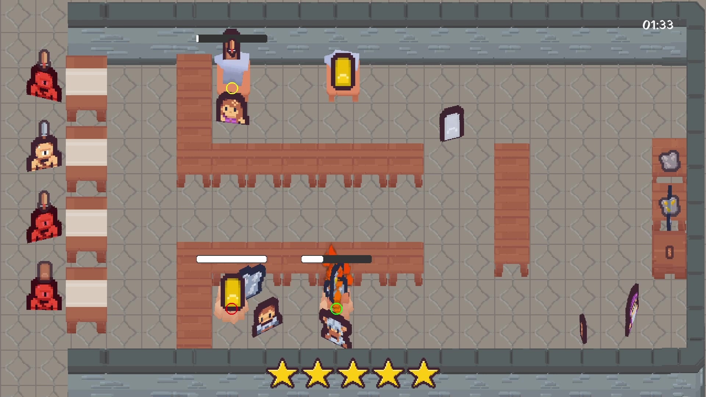
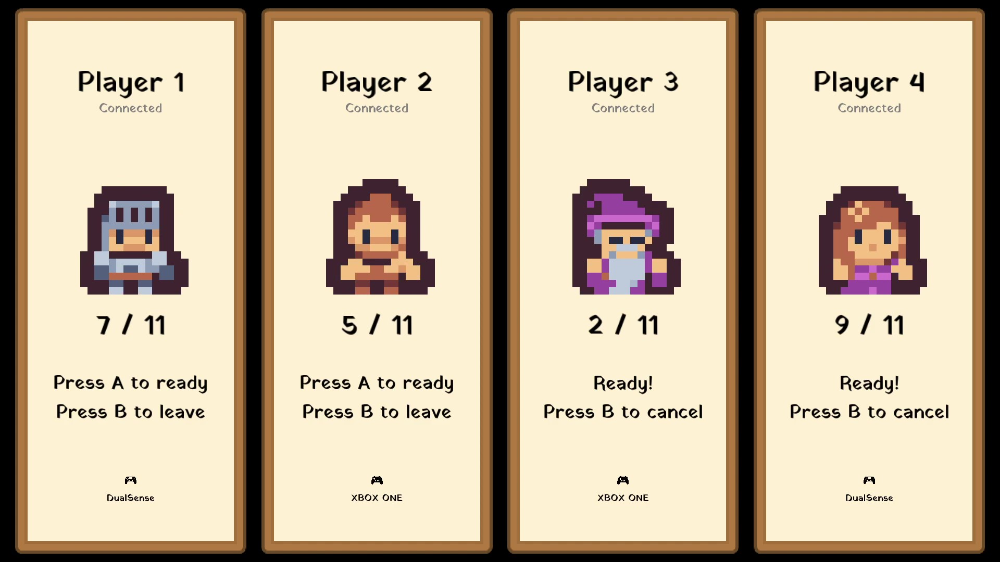
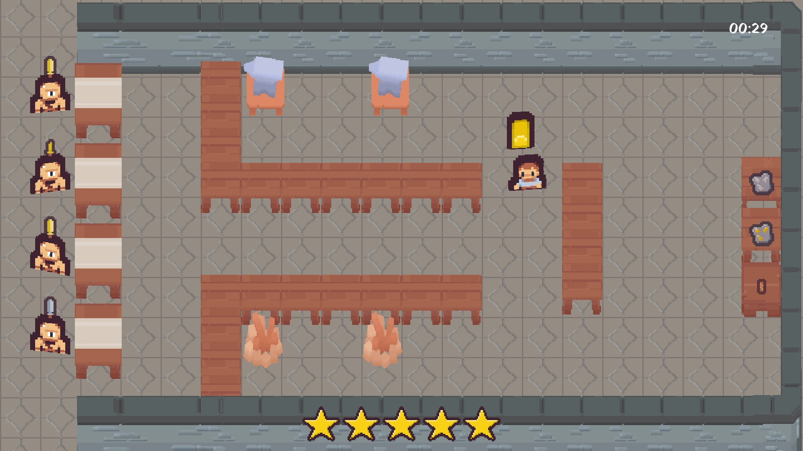

# Nicholas Kilian — Developer Portfolio

- Email: [nkilian.wa@gmail.com](mailto:nkilian.wa@gmail.com)  
- LinkedIn: [linkedin.com/in/nicholas-kilian-2b9279311](https://linkedin.com/in/nicholas-kilian-2b9279311)  
- GitHub: [github.com/FrendorFaux](https://github.com/FrendorFaux)
  
---

## Skills

- **Languages:** C, C++, Python, Java, GLSL, MySQL,
- **Libraries: & Programming Skills** OpenGL, SDL, RapidJSON, Dear ImGui, Data Structures, Operating Systems, Object-Oriented Programming
- **Tools:** Git, Linux, WSL, VS Code, Visual Studio, Trello

---

## Projects

### Robo Repo — Student Project (2023)
*Tech stack: C, FMOD, Visual Studio*  
A game centered around defending your home from "repo-robots," crafting, and shooting your way out of debt.  

- Implemented A* pathfinding for enemy navigation  
- Developed Enemy AI with adaptive behaviors  
- Built Entity management system for game objects  

---

### Solar Scavenger— Student Project (2024)
*Tech stack: C, FMOD, Visual Studio*  
---

### Forge Fiasco — Student Project (2024–2025)
*Tech stack: C++, JSON, OpenGL, GLSL, FMOD, SDL, Dear ImGui, Visual Studio*  
A large-scale student project where I managed a team of four programmers.  

  
  
  

- Designed and implemented a Particle System
- Helped Develop Rendering pipeline and shaders  
- Built an Entity Component System (ECS) with data-driven components
- Integrated Dear ImGui for debugging and tooling  
- Implemented Trace Logging System and Serialization/Deserialization 
- Delegated tasks and coordinated team contributions  

[Gameplay Trailer](https://youtu.be/DMdii-rpamE?si=auxwUUbDHUfNYEQ_)

---

